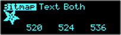
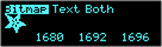
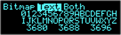
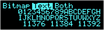
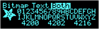
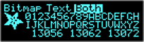

# Minimalist SSD1306 Display Library

Reduce footprint to under 9k for basic sample and make it compatible
with Adafruit_SSD1306 for graphics API as a fallback.

For ATmega328p only.

BitBlit functions for character and bitmap rendering are disabled via
`GFX_NO_BIT_BLIT` definition. This reduces the memory footprint by 856
bytes if both text and bitmap rendering functions are used, and 622
bytes if only text functions are used.

However, bit blit functions speed up rendering by a factor of 3.

|             `GFX_BIT_BLIT`  Enabled              |                  `GFX_NO_BIT_BLIT`                   |
|--------------------------------------------------|------------------------------------------------------|
|  |  |
|      |      |
|     |     |
| The numbers at the bottom of the images are uSec: Min/Avg/Max for rendering the bitmap and/or text.    ||

### Versions

#### 1.19

* Add: Progress bar drawing `gfx_progress_bar_to(...)`

#### 1.18

* Add: Progress bar drawing `gfx_progress_bar_to(...)`

* Fix: reduced character rendering by more than x2 by implementing bit
  blit function to copy character data in bytes where possible. Faster
  char processing if starting on byte boundary for y coordinate
  (0,8,16,24) when one column can be copied in one operation.

  This also sped up display of characters with background color not set
  to NONE. Previously it doubled the rendering time. Now takes about 60%
  more.

#### 1.16

* rename `ssd1306_` prefix to `gfx_` prefix

* remove `gfx_flush_wrap_chars()` and replace with
  `gfx_start_text_spc_wrap()` and `gfx_end_text_spc_wrap()` to delimit
  output that is wrapped. All else is may be wrapped only by right
  margin.

#### 1.14

* Fix: reduced display update by x2, TWI interrupt based update takes 16
  uSec vs 13.5 ms for blocking.

* Fix: reduced char output for display update by optimizing and removing
  unnecessary use of black background when printing screen data, already
  on a black background.

* Add: contrast config option to modify display brightness/contrast.

* Add: `fieldChanged()` callback to `FieldUpdater` to `FieldEditor`
  ability to update external values on value change in the popup (i.e.
  contrast).

#### 1.13

* Fix: optimizations, use interrupt driven TWI interface from
  [ATmega328p](https://github.com/goessl/ATmega328P) library.

#### 1.12

* Fix: gfx circle and round rect

#### 1.6

* Add: small font to allow printing inside single height boxes. ie.
  battery with % charge in it. The battery is assumed to fit into one
  char height and made up of two or three characters.

* Add: proper on white space text wrapping to margins. Handles solid
  runs of non-break text by wrapping where ever to not exceed the right
  margin.

* Add: text bounds now tracks both min/max x/y coordinates where text is
  output. Including cursor moves and text size changes.

#### 1.5

* Fixed code to use the more efficient gfx calls and functionality

#### 1.4

* Change gfx to self rolled. Had 30668 bytes of FLASH used, now only
  23426\.

* rewrite implementation by directly controlling TWI hardware without
  the Arduino I2C library code to reduce implementation to bare minimum.
  This project only has a single slave (OLED display) and only master to
  slave communication at the maximum allowable speed. No need for
  transactions or switching TWI clock speed.

* rewrite SSD1306 implementation to reduce code size for this
  implementation.

#### 1.0

Initial implementation

#### 0.1

* Initial somewhat working graphics

#### 0.2

* Fix: circle quadrants to not overlap when drawing dashed or inverted
  outline.

* Add: octant flags to rect() to draw selected quadrants (top, right,
  bottom, right) and roundRect() to draw selected octants (top,
  top-right corner, right, bottom-right corner, bottom, bottom-left
  corner, left, top-left corner).

### TODO

* Add C++ Ssd1306Display class wrapper with all inline functions for
  mainline API.

