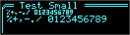
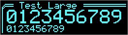
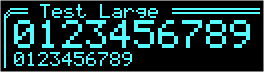

# Minimalist SSD1306 Display Library

Reduce footprint to under 9k for basic sample and make it compatible
with Adafruit_SSD1306 for graphics API as a fallback.

For ATmega328p only.

No scrolling functions, no display rotation, all configuration is
through macros, ATmega328p TWI library for display communication.
Function argument types reduced to minimum and number of arguments
reduced by having X & Y cursors for the current pixel position.

The library supports:

* WHITE, BLACK, INVERT, NONE colors
* patterned lines, upto 8 bit line pattern, disabled via
  `GFX_NO_LINE_PATTERNS` definition which reduces memory footprint by
  420 bytes.
* filled and unfilled rectangles, rounded rectangles, circles
* 5x7 96 character ASCII font,
* double width and/or double height characters
* optional tiny 3x5 character font for digits, enabled by
  `GFX_SMALL_FONT`, adds 360 bytes to memory use. Of the 360 bytes, 204
  bytes is font data and 156 is overhead shared with `GFX_LARGE_FONTS`
  option.  
  
* optional character based font substitution for double height double
  width characters for digits, enabled by `GFX_LARGE_FONT`, adds 690
  bytes to memory use. Of the 690 bytes, 534 bytes is font data and 156
  is overhead shared with `GFX_SMALL_FONTS` option.  
   vs 
* optional BitBlit functions for character and bitmap rendering, can be
  disabled via `GFX_NO_BIT_BLIT` definition. This reduces the memory
  footprint by 856 bytes if both text and bitmap rendering functions are
  used, and 622 bytes if only text functions are used.

  However, bit blit functions speed up rendering by a factor of 3.

  |             `GFX_BIT_BLIT`  Enabled              |                  `GFX_NO_BIT_BLIT`                   |
  |--------------------------------------------------|------------------------------------------------------|
  |  |  |
  |      |      |
  |     |     |

  The numbers at the bottom of the images are uSec: Min/Avg/Max for
  rendering the bitmap and/or text, taken from an 8MHz arduino.

